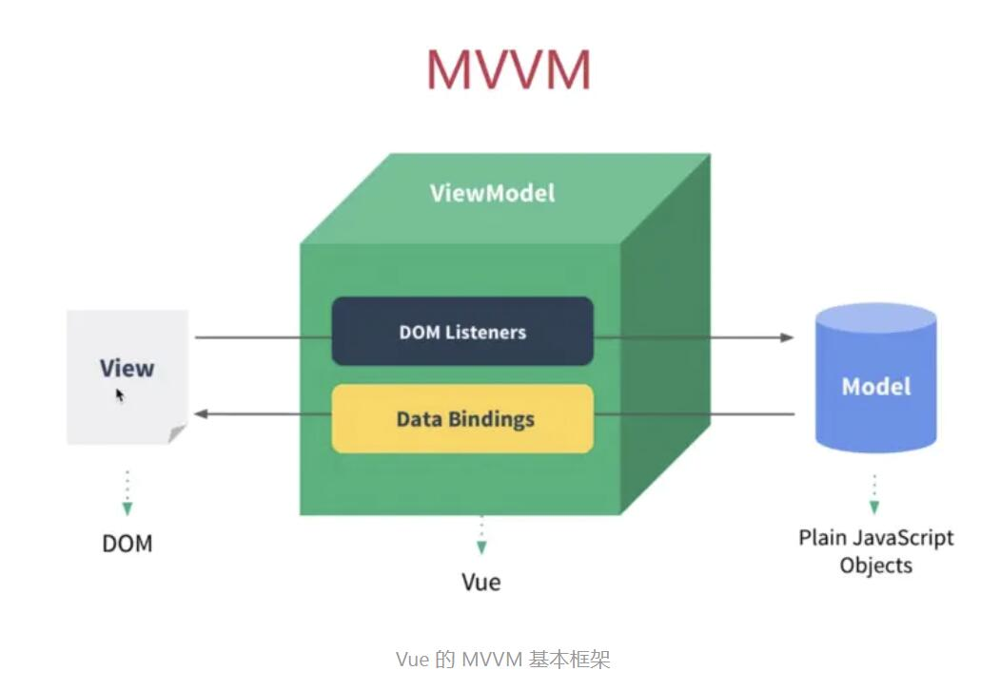

# 结课作业提交仓库

# 百度前端作业方向二——实现简单的MVVM框架
1.克隆下来后, 执行 npm install 安装依赖

2.npm run build 打包

3.找到dist文件下的index.html文件打开即可看到项目运行结果

4.npm run test 运行测试用例

## 实现功能
- 数据劫持
- 发布订阅模式
- 单向数据绑定
- 双向数据绑定


## 目录结构
```
|-- src
  |-- compiler-Vue1  //Vue1.x的编译器的实现逻辑
  |-- compiler-Vue2  //Vue2.x的编译器的实现逻辑
      |-- compileToFunction.ts    //解析模板生成渲染函数
      |-- generate.ts      //从 ast 生成渲染函数
      |-- index.ts     //解析渲染，挂载
      |-- mountComponent.ts //初始渲染和后续更新
      |-- parse.ts      //解析模版字符串，生成 AST 语法树
      |-- patch    //虚拟DOM生成正是DOM
      |-- renderHelper.ts  //在 Vue 实例上安装运行时的渲染帮助函数
      |-- type.ts   // 项目主要类型声明
      |-- vnode.ts  //虚拟节点声明
  |-- asyncUpdateQueue.ts  //实现异步更新watcher队列
  |-- defineReactive.ts //实现数据劫持
  |-- Dep.ts  //依赖收集
  |-- index.js
  |-- initComputed.ts  //初始化 computed 配置项
  |-- initData.ts. //初始化data
  |-- myMVVM.ts  //Vue构造函数
  |-- observe.ts  //通过 Observer 类为对象设置响应式能力
  |-- observer.ts  //为普通对象或者数组设置响应式的入口文件
  |-- protoArgument.ts  //通过拦截数组的七个方法来实现数组响应式
  |-- proxy.ts  //代理
  |-- utils.ts //存放工具类
  |-- vue.test.js  //测试文件
  |-- watcher.ts 监听更新
```


## 0. 概念设计

MVVM 框架的全称是 Model-View-ViewModel,它是 MVC（Model-View-Controller）的变种。

要想实现MVVM，就要实现数据、试图分离，并且将DOM操作封装，这样开发者只需要操作数据，不需要手动操作DOM元素。



VUE官网可以查询到的VUE搭建的MVVM框架如上。要想实现MVVM，关键在于ViewModel中的DOM Listeners和Data Bindings。它们的作用分别是观察View，并将View上的用户造成的数据改变拦截然后同步给Model；以及在Model中数据更改时，将与该数据绑定的DOM元素进行同步改变。

为了更好的实现MVVM框架，我将项目拆分成几个模块，分为不同迭代增量完成项目。

## 1. 实现数据劫持

###  1.1 普通对象
```typescript
/**
 * 通过 Object.defineProperty 为 obj.key 设置 getter、setter 拦截
 */
export default function defineReactive(obj, key, val) {
  // 递归调用 observe，处理 val 仍然为对象的情况
  observe(val)

  Object.defineProperty(obj, key, {
    // 当发现 obj.key 的读取行为时，会被 get 拦截
    get() {
      console.log(`getter: key = ${key}`)
      return val
    },
    // 当发生 obj.key = xx 的赋值行为时，会被 set 拦截
    set(newV) {
      console.log(`setter: ${key} = ${newV}`)
      if (newV === val) return
      val = newV
      // 对新值进行响应式处理，这里针对的是新值为非原始值的情况，比如 val 为对象、数组
      observe(val)
    }
  })
}
```

###  1.2  数组
通过拦截数组的七个方法来实现

```typescript
// 数组默认原型对象
const arrayProto = Array.prototype
// 以数组默认原型对象为原型创建一个新的对象
const arrayMethods = Object.create(arrayProto)
// 被 patch 的七个方法，通过拦截这七个方法来实现数组响应式
// 为什么是这七个方法？因为只有这七个方法是能更改数组本身的，像 cancat 这些方法都是会返回一个新的数组，不会改动数组本身
const methodsToPatch = ['push', 'pop', 'unshift', 'shift', 'splice', 'sort', 'reverse']

// 遍历 methodsToPatch
methodsToPatch.forEach(method => {
  // 拦截数组的七个方法，先完成本职工作，再额外完成响应式的工作
  Object.defineProperty(arrayMethods, method, {
    value: function(...args) {
      // 完成方法的本职工作，比如 this.arr.push(xx)
      const ret = arrayProto[method].apply(this, args)
      // 将来接着实现响应式相关的能力
      console.log('array reactive')
      return ret
    },
    configurable: true,
    writable: true,
    enumerable: true
  })
})

/**
 * 覆盖数组（arr）的原型对象
 * @param {*} arr 
 */
export default function protoArgument(arr) {
  arr.__proto__ = arrayMethods
}

```


### 1.3 效果

为了测试效果，我新建了一个对象实例，并属于了一些实验用的对象属性及其值

```typescript
let data = {
  name: "张三",
  age: 19,
  arr: [1,2,3],
  nameArr: [{name: '张三'},{name: '李四'},{name: '王五'}]
};
```

结果如下：


可以看到，在获取`data.age`值时调用了get，在控制台上打印了数据名称

在给`data.age`重新赋值时，调用了set函数

使用数组的push方法是，同样监听到了，在给数组对象重新赋值`data.nameArr[0].name`,实现了数组的深度监听


## 2.实现发布订阅模式
现在已经能拦截到对数据的获取和更新，接下来就可以在拦截数据的地方增加一些 “能力”，以完成 数据响应式更新 的功能。

增加的这些能力其实就是在 getter 中进行依赖收集，setter 中依赖通知 watcher 更新

### 2.1Dep依赖收集

```typescript
/**
 * Dep
 * Vue1.0 中 key 和 Dep 是一一对应关系，举例来说：
 * new Vue({
 *   data() {
 *     return {
 *       t1: xx,
 *       t2: {
 *         tt2: xx
 *       },
 *       arr: [1, 2, 3, { t3: xx }]
 *     }
 *   }
 * })
 * data 函数 return 回来的对象是一个 dep
 * 对象中的 key => t1、t2、tt2、arr、t3 都分别对应一个 dep
 */
function Dep() {
  // 存储当前 dep 实例收集的所有 watcher
  this.watchers = []
}

// Dep.target 是一个静态属性，值为 null 或者 watcher 实例
// 在实例化 Watcher 时进行赋值，待依赖收集完成后在 Watcher 中又重新赋值为 null
Dep.target = null

/**
 * 收集 watcher
 * 在发生读取操作时（vm.xx) && 并且 Dep.target 不为 null 时进行依赖收集
 */
Dep.prototype.depend = function () {
  // 防止 Watcher 实例被重复收集
  if (this.watchers.includes(Dep.target)) return
  // 收集 Watcher 实例
  this.watchers.push(Dep.target)
}

/**
 * dep 通知自己收集的所有 watcher 执行更新函数
 */
Dep.prototype.notify = function () {
  for (let watcher of this.watchers) {
    watcher.update()
  }
}
/**
 * @param {*} cb 回调函数，负责更新 DOM 的回调函数
 */


```
### 2.2 依赖通知 Watcher 更新

```typescript
function Watcher(cb) {
  // 备份 cb 函数
  this._cb = cb
  // 赋值 Dep.target
  Dep.target = this
  // 执行 cb 函数，cb 函数中会发生 vm.xx 的属性读取，进行依赖收集
  cb()
  // 依赖收集完成，Dep.target 重新赋值为 null，防止重复收集
  Dep.target = null
}

/**
 * 响应式数据更新时，dep 通知 watcher 执行 update 方法，
 * 让 update 方法执行 this._cb 函数更新 DOM
 */
Watcher.prototype.update = function () {
  this._cb()
}

```

### 2.3 Observer
改造 Observer 构造函数，在 `value.ob` 对象上设置一个 dep 实例。这个 dep 是对象本身的 dep，方便在更新对象本身时使用，比如：数组依赖通知更新时就会用到。

```typescript
/**
 * 为普通对象或者数组设置响应式的入口
 */
export default function Observer(value) {
  // 为对象本身设置一个 dep，方便在更新对象本身时使用，比如 数组通知依赖更新时就会用到
  this.dep = new Dep()  
  // ... 省略已有内容
}
```

改造 defineReactive 方法，增加依赖收集和依赖通知更新的代码
```typescript
    get() {
      // 读取数据时 && Dep.target 不为 null，则进行依赖收集
      if (Dep.target) {
        dep.depend()
        // 如果存在子 ob，则顺道一块儿完成依赖收集
        if (childOb) {
          childOb.dep.depend()
        }
      }
      console.log(`getter: key = ${key}`)
      return val
    },

    set(newV) {
      console.log(`setter: ${key} = ${newV}`)
      if (newV === val) return
      val = newV
      // 对新值进行响应式处理，这里针对的是新值为非原始值的情况，比如 val 为对象、数组
      observe(val)
      // 数据更新，让 dep 通知自己收集的所有 watcher 执行 update 方法
      dep.notify()
    }
```


## 3 实现数据单向和数据双向绑定
有了数据劫持和发布订阅模式的基础，现在我们需要实现真正的数据单向绑定和双向绑定。

首先要做的就是真正实现数据劫持和发布订阅模式中对Model和View的数据变更，而不只是打印在控制台上

在发布与订阅中Watcher 构造函数似乎从来没有被实例化过，挂载阶段，初始化完成后执行 $mount，$mount 调用 mountComponent，mountComponent 方法中有一步就是在实例化 Watcher 接下来要实现的就是编译器了，也就是 $mount 方法。


```typescript
/**
 * 编译器
 */
function mount(vm) {
  // 获取 el 选择器所表示的元素
  let el = document.querySelector(vm.$options.el)

  // 编译节点
  compileNode(Array.from(el.childNodes), vm)
}

function compileNode(nodes, vm) {
  // 循环遍历当前节点的所有子节点
  for (let i = 0, len = nodes.length; i < len; i++) {
    const node = nodes[i]
    if (node.nodeType === 1) { // 元素节点
      // 编译元素上的属性节点
      compileAttribute(node, vm)
      // 递归编译子节点
      compileNode(Array.from(node.childNodes), vm)
    } else if (node.nodeType === 3 && node.textContent.match(/{{(.*)}}/)) {
      // 编译文本节点
      compileTextNode(node, vm)
    }
  }
}
```
编译文本节点

```typescript
/**
 * 编译文本节点
 * @param {*} node 节点
 * @param {*} vm Vue 实例
 */
function compileTextNode(node, vm) {
  // <span>{{ key }}</span>
  const key = RegExp.$1.trim()
  // 当响应式数据 key 更新时，dep 通知 watcher 执行 update 函数，cb 会被调用
  function cb() {
    node.textContent = JSON.stringify(vm[key])
  }
  // 实例化 Watcher，执行 cb，触发 getter，进行依赖收集
  new Watcher(cb)
}
```

编译节点上的属性
```typescript
/**
 * 编译属性节点
 * @param {*} node 节点
 * @param {*} vm Vue 实例
 */
function compileAttribute(node, vm) {
  // 将类数组格式的属性节点转换为数组
  const attrs = Array.from(node.attributes)
  // 遍历属性数组
  for (let attr of attrs) {
    // 属性名称、属性值
    const { name, value } = attr
    if (name.match(/v-on:click/)) {
      // 编译 v-on:click 指令
      compileVOnClick(node, value, vm)
    } else if (name.match(/v-bind:(.*)/)) {
      // v-bind
      compileVBind(node, value, vm)
    } else if (name.match(/v-model/)) {
      // v-model
      compileVModel(node, value, vm)
    }
  }
}


/**
 * 编译 v-on:click 指令
 * @param {*} node 节点
 * @param {*} method 方法名
 * @param {*} vm Vue 实例
 */
compileVOnClick(node, method, vm) {
  // 给节点添加一个 click 事件，回调函数是对应的 method
  node.addEventListener('click', function (...args) {
    // 给 method 绑定 this 上下文
    vm.$options.methods[method].apply(vm, args)
  })
}

/**
 * 编译 v-bind 指令
 * @param {*} node 节点
 * @param {*} attrValue 属性值
 * @param {*} vm Vue 实例
 */


function compileVBind(node, attrValue, vm) {
  // 属性名称
  const attrName = RegExp.$1
  // 移除模版中的 v-bind 属性
  node.removeAttribute(`v-bind:${attrName}`)
  // 当属性值发生变化时，重新执行回调函数
  function cb() {
    node.setAttribute(attrName, vm[attrValue])
  }
  // 实例化 Watcher，当属性值发生变化时，dep 通知 watcher 执行 update 方法，cb 被执行，重新更新属性
  new Watcher(cb)
}

/**
 * 编译 v-model 指令
 * @param {*} node 节点 
 * @param {*} key v-model 的属性值
 * @param {*} vm Vue 实例
 */
function compileVModel(node, key, vm) {
  // 节点标签名、类型
  let { tagName, type } = node
  // 标签名转换为小写
  tagName = tagName.toLowerCase()
  if (tagName === 'input' && type === 'text') {
    // <input type="text" v-model="inputVal" />

    // 设置 input 输入框的初始值
    node.value = vm[key]
    // 给节点添加 input 事件，当事件发生时更改响应式数据
    node.addEventListener('input', function () {
      vm[key] = node.value
    })
  } else if (tagName === 'input' && type === 'checkbox') {
    // <input type="checkbox" v-model="isChecked" />

    // 设置选择框的初始状态
    node.checked = vm[key]
    // 给节点添加 change 事件，当事件发生时更改响应式数据
    node.addEventListener('change', function () {
      vm[key] = node.checked
    })
  } else if (tagName === 'select') {
    // <select v-model="selectedValue"></select>

    // 设置下拉框初始选中的选项
    node.value = vm[key]
    // 添加 change 事件，当事件发生时更改响应式数据
    node.addEventListener('change', function () {
      vm[key] = node.value
    })
  }
}

```

### 效果图


## 单元测试

### 测试内容
本次测试一共设置了10个测试用例，分别测试单向绑定插值语法，数据响应式更新，元素节点属性绑定，计算属性，组件和插槽
在项目根目录中vue.test.js测试文件下查看
测试结果如下


10个用例全部通过，总语句覆盖率81.98%，功能覆盖率90.12%


